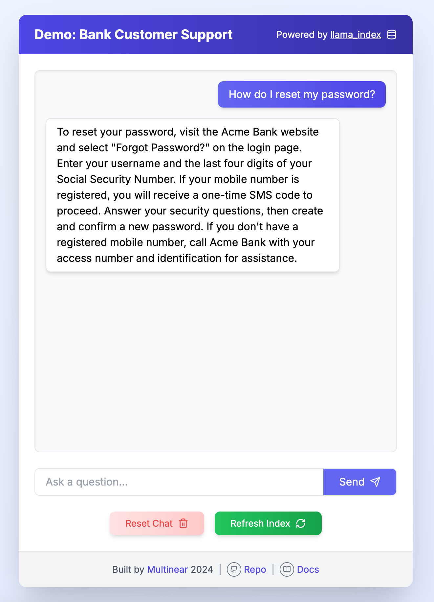

# Demo Bank Customer Support

This is a simple RAG demo for a bank's customer support bot, for use with the [Multinear](https://multinear.com) platform.



## Introduction

This project shows how simple it is to build a proof-of-concept using RAG for a customer support bot answering user questions on FAQ data, with platforms like [llama_index](https://github.com/jerryjliu/llama_index). 

The real challenge is to ensure that this bot is reliable - always giving the right answer, not hallucinating, and knowing how to deal with ambiguous or off-topic questions. GenAI is a powerful technology, but it's also **unpredictable by design**, and the only way to make it reliable is to build comprehensive test coverage and guardrails. 

That's exactly what the Multinear platform is for. Multinear allows developers to define evaluations in a simple yet powerful way and iteratively develop their GenAI applications, ensuring reliability and security.


## Installation

1. **Clone the Repository**

    ```bash
    git clone https://github.com/multinear-demo/demo-bank-support-li-py
    cd demo-bank-support-li-py
    ```

2. **Configure Environment Variables**

   Create a `.env` file in the root directory and add your OpenAI API key:

    ```bash
    echo "OPENAI_API_KEY=your-api-key-here" > .env
    ```

### Option 1: Using `uv` (Recommended)

   [`uv`](https://github.com/astral-sh/uv) is the fastest way to run the application with minimal setup.

```bash
# Setup Environment
uv sync

# Start the Application
uv run main.py
```

### Option 2: Using `pyenv`

   [`pyenv`](https://github.com/pyenv/pyenv) allows you to manage multiple Python versions and virtual environments.

```bash
# Setup Environment
pyenv install 3.9
pyenv virtualenv 3.9 demo-bank
pyenv local demo-bank
pip install -r requirements.txt

# Start the Application
python main.py
```

### Option 3: Using Python's Built-in `venv`

```bash
# Setup Environment
python3 -m venv .venv
source .venv/bin/activate
# On Windows:
# .\.venv\Scripts\activate
pip install -r requirements.txt

# Start the Application
python3 main.py
```

Open http://localhost:8080 to see the application.

---

### Jupyter Notebook

```bash
# Using uv
uv run --with jupyter jupyter lab notebook.ipynb

# Using pyenv / virtualenv
pip install jupyter
jupyter lab notebook.ipynb
```

## Architecture

   Key system components:

1. **RAG Engine (`engine.py`):** Handles document ingestion, indexing, and query processing using the `llama_index` library and OpenAI model.
2. **API Server (`main.py`):** Backend built with `FastAPI`, with endpoints for chat, reindexing, and session management.
3. **Frontend (`static/index.html` & `static/app.js`):** A `React`-based UI.
4. **Data** (`data/acme_bank_faq.txt`):** Dataset for the RAG engine.
5. **Experiment Runner (`.multinear/task_runner.py`):** Entry point for `Multinear` platform.
6. **Configuration (`.multinear/config.yaml`):** Defines evaluation tasks.

## Experimentation Platform

   The platform is designed to facilitate the development and evaluation of GenAI applications through systematic experimentation.

### Running Experiments

1. **Define Tasks**

   Configure your evaluation tasks in `.multinear/config.yaml`. Each task represents a specific input scenario for the customer support bot, and defines how to evaluate the output.

2. **Execute Experiments**

   Run `Multinear` platform.

    ```bash
    # Using uv
    uv run multinear web_dev

    # Using pyenv / virtualenv
    multinear web_dev
    ```

   Open http://localhost:8000 and start experimenting.

## License

This project is licensed under the [MIT License](LICENSE).

---

*Built by [Multinear](https://multinear.com). For more information, visit our [documentation](https://multinear.com/docs/).*
